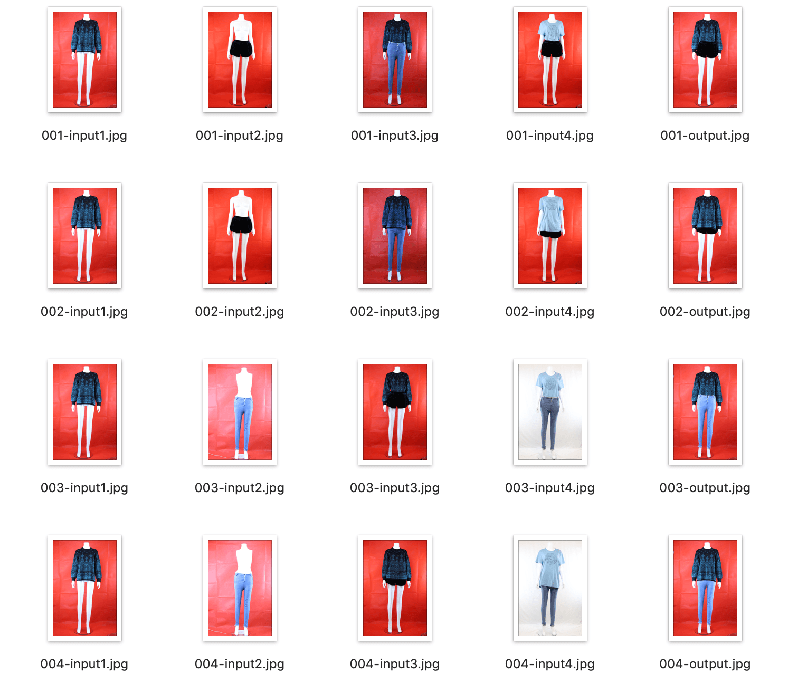

# Clothing Synthesis

This is a solution of AI homework. Here is the question:

Synthesize top image and bottom image into output image. Every group of input
consists of 4 input images.  
input1.jpg: top image  
input2.jpg: bottom image  
input3.jpg: match of top and bottom (wear top into bottom or not)  
input4.jpg: match of top and bottom (waer top into bottom or not)  

